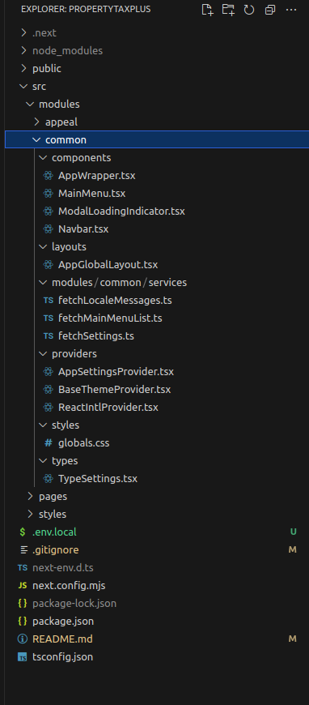

## Local Setup
clone the `main` branch `.env.local` in root folder and and name it `.env.local`
## Getting Started


First, run the development server:

```bash
npm run dev
```

Open [http://localhost:3000](http://localhost:3000) with your browser to see the result.

You can start editing the page by modifying `pages/index.tsx`. The page auto-updates as you edit the file.

## Dev Approach

### Targeted Tech Stack

- Next.js
- TypeScript
- React.js
- React Hooks
- React Context
- React-intl
- React-query - https://react-query-v3.tanstack.com/
- Antd design - https://ant.design/components/overview/
- CSS Modules

This repo is structured to use minimal deps and be vannila Next.js as possible

- Allows to upgrade easily to never versions of Next.js
- Helps to keep codebase evergreen
- Limit exposure to security concerns

It focusses on parellel development where every page is consided a module, and a developer or a dev team can will own a module folder where the ALL module specific code should reside

It is ok to duplicate components from other modules over importing them directly. If we identify the duplication repeated multiple times, then we willl promote the component to a common module, and import from there.


## Prerequisites
 - Install following packages on local:
    - node -> v18.19.0
    - npm  -> 10.2.3
    - Need to install nvm to manage the node version , You can take help of this doc. to install nvm -> https://medium.com/@isaacjoe/best-way-to-install-and-use-nvm-on-mac-e3a3f6bc494d
    - You can download required version using nvm -> `nvm install 8.11.1`
    - switch to the desired node version -> `nvm use 8.11.1`
    - if you run in to errors try updating node to the latest version

## Setup and start web-application
 - Move to the desire location in the local and clone the forked repository
 - Clone `git clone https://github.com/devtoprated/propertytaxplus.git`
 - `cd propertytaxplus`
 - Run `npm install` before first time after clone propertytaxplus from github
 - Access the application at `https://localhost:3000`


### services

A file for each remote endpoint that gets invoked by react query.
It might require to define the TS Types of the following

1. api input structure
2. structure of the result data returned by api
3. structure of the error data returned by api (optional)

An exported async function that uses `fetch()` to call the remote endpoint URLs which is imported from config.ts

see `src/modules/appeal/services/fetchAppealData.ts`

- every service should reside in a file of its own (1 end point per file)
- when multiple params need to be passed as inputs, pass them as an object instead of arg list
eg:
````
service({param1, param2, ...}:ServiceInputParams) is preferred over service(param1, param2, ...)
````
- when types for input params are defined, its best to have it defined in the same file
- the `fetchWrapper()` should always be used when calling apis
- if query strings need to be passed use the `makeUrlsWithQueryStrings()` util
- if path params need to be replaced use `replacePathParams()`
- the service should always have a Promise return type defined - eg: `:Promise<TypeGlobalConfig>`  
- the return type for the response also needs to be defined within the class.

### Code linting formatting

- Format code on save
- Use popular eslint ruleset and adhere to it
- Avoid the use of `any` in TypeScript
- Few more rules needs to be followed, will need dev inputs on this


## Creating a new Page (Module)

Every page should be considered a module,
When a new page needs to be created,

1. Inside the `pages` folder, create a file named `/<PARENT_FOLDER>/<PAGE_NAME>.tsx`
2. Inside the `modules` folder create a new folder with the name `<PARENT_FOLDER>.<PAGE_NAME>`. Notice the `.`(dot) between the `<PARENT_FOLDER>` and `<PAGE_NAME>`. The exprectation is to have a linear folder structure to avoid the nesting of modules into subfolders.
3. Create a component inside the root of the newly created module folder. This servers as the extry component to the page created in step 1.

see the `src/pages/content-management/translation-text.tsx` and `src/modules/content-management.translation-text` for a reference implementation.

### Set proper layout for pages

For the purpose of getting the page developed to be hosted within the propertytaxplus make sure the `getLayout()` of the page component in the page file doesnt wrap with `AppGlobalLayout`, if testing, the layout can be added.

## Module Folder structure



### components

This folder holds all the subcomponents needed for the rendering of the main page component. Its alright for folder hierachies to be setup for the sake of sanity or organization. When subdirectories are made, it is best to name the folder after the parent component.

### config

The config folder should hold a file named `config.ts`, it should import all environment variables used in the module, and all the code in the module should use the exported values in `config.js`.
With this we centralize the external environment dependencies of the module.
see `src/modules/content-management.translation-text/config/config.ts`

- there should not be any `process.env.*` references anyehre else in code expect is `/<module.name>/config/config.ts` files
- As a good practice, for url variables always have a fallback for a specific to override the whole url as well as the basepath, 
eg : 
```
  const UPLOAD_PATH = 
    TRANSLATION_TEXT_UPLOAD_PATH ||
    `${TRANSLATION_TEXT_BASE_URL}/v1/${BASE_PATH}/admin/localisation/upload`,
```

### enums

Static combination of multiple values can be defined here. Really important for Typescript adoption

- if there are fixed set of stings for a certain variable, define them as ENUMs, 
- Use enum consts instead of hardcoded strings in code


### types
Common type definitions for stuctures used by the component journeys
- If you found that same Type is used in multiple services either as a main type or subtype, then its eligible to be a file on its own
- Ideally the Type file should only have one Type exported
- The name of the file will be prefixed with Type or I, and it should contain a type definition with the same filename
- it is ok to have multiple non exported types in a types file

### providers

The `providers` folder will host the contexts used by the module that serve as the module state.
2 types of state are candidates for being in a context

1. Data that needs to be injected deep into the component tree (To prevent prop drilling) and/or
2. Common data that needs to be shared between sibling components

A generic provider file should contain 4 main definitions.

1. The TS interface that defines the shape of data stored in the Context, named by convention as `<CONTEXT_NAME>ContextValue`
2. The definition of the actual context with `React.createContext()`, by convention named `<CONTEXT_NAME>Context`
3. The definition of the Provider react component, that accepts the chilren prop along with additional values.
4. The definition of the react hook, that retuns the context values, this hook is the one that will be used by components to access context values.

see `src/modules/common/providers/AppSettingsProvider.tsx` for a sample

- If a provider is extremely long, (too many variables for its values) , then its a code smell, either its trying to do too much or is holding unnessasry info, 
- either way, it needs to be cleaned up or broken down to smaller subcontexts or files. 
- in an ideal sense, a provider should only be made per user journey or workflow.
- The context should NOT be directly exported in the file, its expected to reside within the file
- Any context that needs to be exposed should be made accessible via the hook that wraps it


## react-query good practices 
- every useQuery should have the {loading, error} state handled 
- for useQuery avoid using onSuccess, onError callbacks,
- the {mutuate:properName} in useMutations should be renamed appropariately 
- the queryFn or mutateFn should ideally be a function defined in a file in the services directory

